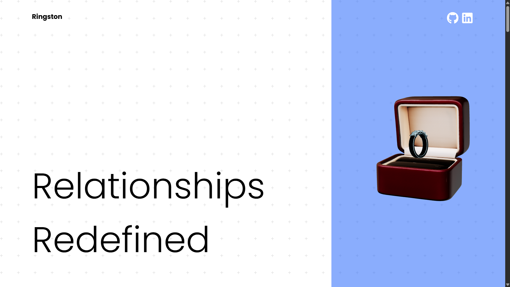

# 💍 Ringston 3D Experience

> **A stunning interactive 3D website** built with **React**, **Three.js**, **GSAP**, and more — scroll-driven, animated, immersive.

[](https://ringston.vercel.app)
[](./LICENSE)
[](https://reactjs.org/)
[](https://threejs.org/)
[](https://greensock.com/gsap/)

---

## 🖼️ Previews




---

## 🌟 Key Features

| Feature | Description |
|--------|-------------|
| 💍 **Scroll-Linked 3D Animation** | A ring emerges, scales, and exits based on scroll progress |
| 💫 **Parallax Effects** | Smooth motion of UI elements based on scroll speed |
| ↔️ **Horizontal Scroll Section** | Pinned layout with horizontal transitions and text reveals |
| 🧊 **3D Object Re-Entry** | Reappearance of 3D ring in wireframe style |
| 🧠 **AI-generated 3D Model** | Created via AI from text → image → 3D model, lit for realism |

---

## 🛠️ Tech Stack

| Tech | Role |
|------|------|
| ⚛️ **React** | Base framework |
| 🌀 **Three.js** | Core 3D engine |
| 🪐 **React Three Fiber** | React renderer for Three.js |
| 🎬 **GSAP + ScrollTrigger** | Scroll animations and timeline control |
| 🧰 **Drei** | Useful helpers for 3D scenes |
| ⚡ **Vite** | Lightning-fast dev environment |
| 🎨 **Tailwind CSS** | Utility-first responsive styling |
| 🖌️ **CSS Modules** | Component-scoped styles |

---

## 🚀 Live Demo

👉 [**Check it out on Vercel**](https://ringston.vercel.app)

---

## 📦 Getting Started

Clone the repo and run locally:

```bash
# 1. Clone the project
git clone https://github.com/Mausam5055/Ringston.git
cd Ringston

# 2. Install dependencies
npm install

# 3. Run the dev server
npm run dev
```

---

## 👨‍💻 Connect with Me

Feel free to reach out or follow me on:

💻 GitHub: [github.com/Mausam5055](https://github.com/Mausam5055)

💼 LinkedIn: [linkedin.com/in/mausam-kar-6388861a7](https://www.linkedin.com/in/mausam-kar-6388861a7)

📫 Email: mausamofficial5055@gmail.com
